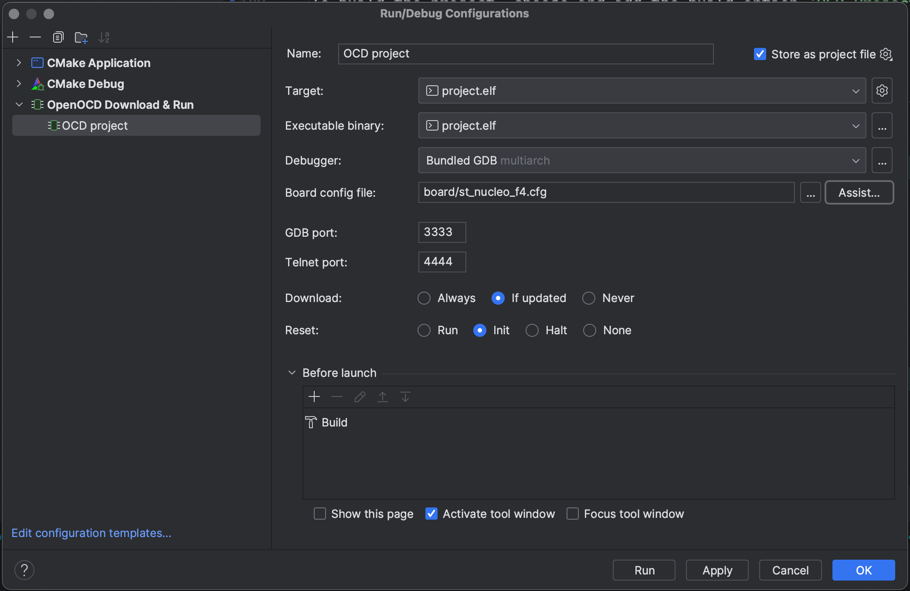

# Building and debugging instructions

## Prerequisites

> For Windows users, make sure the shell you are using is either PowerShell, Git Bash or WSL. The default Windows
> Command Prompt is not supported.

### Project Management

Install stm32cubemx from [here](https://www.st.com/en/development-tools/stm32cubemx.html)


### Building tools

#### CMake

The project is built using CMake. To install CMake, follow the instructions below:

Windows (make sure you have [scoop](https://scoop.sh/) installed):

```bash
scoop install cmake
```


macOS (make sure you have [brew](https://brew.sh/) installed):

```bash
brew install cmake
```


#### Cross-compilation toolchain

To compile, build and debug the project, you also need to have `arm-none-eabi-gcc` and `openocd` installed with scoop(
and only scoop because this package doesn't exist in the package index of Chocolatey or winget):

##### gcc-arm-none-eabi

Windows:

```powershell
scoop bucket add extras
scoop install extras/gcc-arm-none-eabi
```


macOS:

> **DON'T INSTALL gcc-arm-none-eabi DIRECTLY VIA BREW SINCE IT RESULTS IN BROKEN DEPENDENCIES**

```bash
brew install --cask gcc-arm-embedded
```


##### openocd

The sourcecode of `openocd` is included as git submodule, so you can build it on your own with
the [source code](dependencies/openocd-esp32)

openocd uses `make` as its building tool. Use the following command to install these prerequisites:

Windows:

```bash
scoop install gcc make autoconf automake libtool pkg-config
```


MacOS:

```bash
brew install automake libtool libusb wget pkg-config
```


Then, build with following command:

```bash
cd dependencies/openocd-esp32
./bootstrap
./configure
make
make install DESTDIR=$PWD/out
```


The openocd executable file will be in `dependencies/openocd-esp32/out/usr/local/bin/`, called `openocd`

## Building and debugging

The recommended building platform and IDE is [CLion](https://www.jetbrains.com/clion/).

### CLion


To build the project, choose and add the build option `OCD Project` and relaunch the project to make the predefined options to appear



### Manually build with CMake:

If this is the first time build, make a directory called `build` in the project directory (`./project/`)

```bash
cd project
mkdir build
```


then generate CMake build files:

```bash
cd build
cmake ..
```


then build the project:

```bash
make
```


The output file is `project.elf`, then you will use `openocd` you compiled yourself to flash the program to the board.

to flash the program to the board, run:

> **MAKE SURE YOU ARE UNDER `project` DIRECTORY**

```bash
dependencies/openocd-esp32/out/usr/local/bin/openocd -s dependencies/openocd-esp32/out/usr/local/share/openocd/scripts -f st_nucleo_f4.cfg -c "tcl_port disabled" -c "gdb_port disabled" -c "telnet_port disabled" -c "program \"./project.elf\"" -c reset -c shutdown
```


to debug the program, run:

```bash
dependencies/openocd-esp32/out/usr/local/bin/openocd -s dependencies/openocd-esp32/out/usr/local/share/openocd/scripts -f st_nucleo_f4.cfg -c "tcl_port disabled" -c "gdb_port 3333" -c "telnet_port 4444" -c "program \"./project.elf\"" -c "init;reset init;" -c "echo (((READY)))"
```


then you can connect to the program with `telnet` with port `4444` or `gdb` with port `3333`
